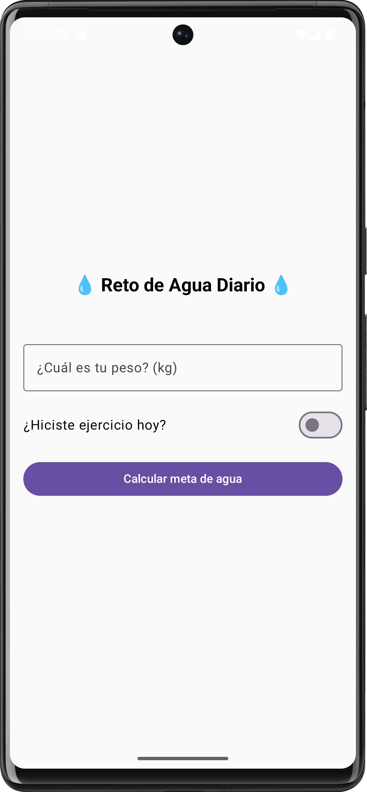
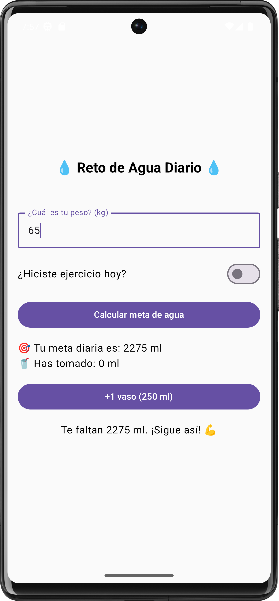
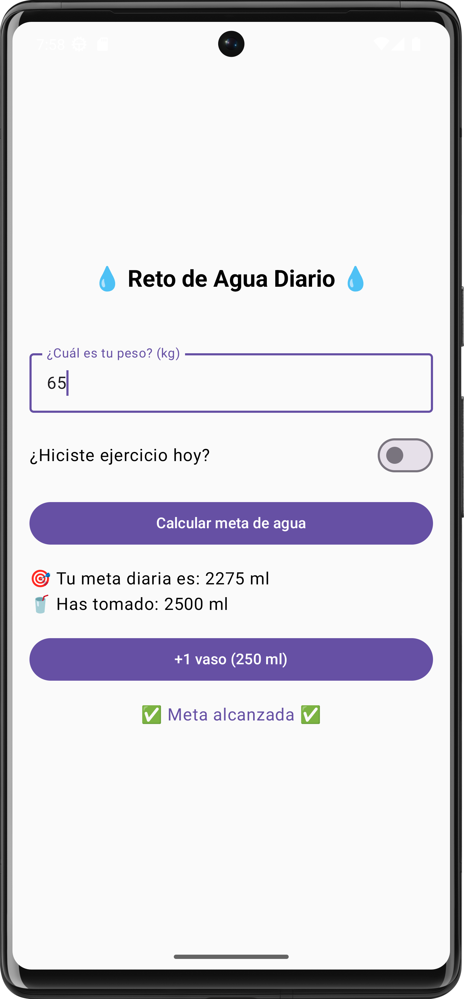

# 💧 RetoAguaApp (con estado) – Calculadora de Hidratación Diaria 💧

Aplicación móvil desarrollada con **Jetpack Compose** que permite calcular una **meta diaria de consumo de agua** según el peso del usuario y si ha realizado ejercicio. Los usuarios pueden registrar la cantidad de agua consumida y hacer seguimiento a su progreso diario.

---

## 🚀 Características

- ✅ Cálculo de la meta diaria (ml) según peso y actividad física.
- 🥤 Registro de vasos de agua tomados (cada vaso equivale a 250 ml).
- 📊 Visualización del avance en tiempo real.
- 🎯 Notificación textual cuando se alcanza la meta diaria.
- 🎓 Código didáctico comentado para fines educativos.

---

## 🧠 Tecnologías utilizadas

- Kotlin
- Jetpack Compose
- Material 3
- Android Studio (recomendado: Giraffe o posterior)

---

## 📷 Vistas principales de la app

<p align="center">
  
  
  
</p>

```bash
📱 Pantalla principal
- Ingreso de peso
- Selección de si hizo ejercicio
- Botón para calcular meta
- Botón para sumar vasos tomados
```

---

## 🛠️ Cómo clonar y ejecutar este proyecto

```bash
git clone https://github.com/alejing/reto-agua-app-con-estado
cd reto-agua-app-con-estado
```

1. Abre el proyecto en **Android Studio**.
2. Espera a que se sincronicen las dependencias.
3. Ejecuta la app en un emulador o dispositivo físico con Android 8.0 o superior.

---

## 📚 Propósito educativo

Este proyecto fue desarrollado como apoyo a un curso de **desarrollo móvil** con Kotlin y Jetpack Compose. Está pensado para que los estudiantes aprendan conceptos clave como:

- Manejo de **estados** con `remember` y `mutableStateOf`
- Estructuración de interfaces con `Column`, `Row`, `Spacer`
- Manejo de entradas de usuario con `OutlinedTextField` y `Switch`
- Respuesta a eventos con `Button` y lógica condicional

---

## 👨‍🏫 Autor y licencia

Proyecto desarrollado por **José Alejandro Franco Calderon** con fines educativos.  
Licencia: MIT

---
